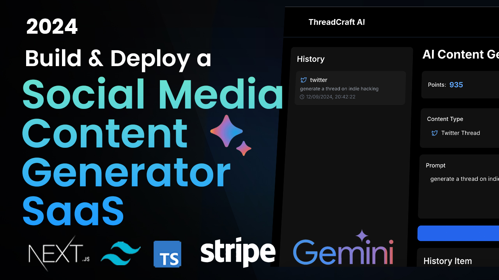

<p align="center">
  
</p>

# ThreadCraft AI: Social Media Content Generator

ThreadCraft AI is a powerful Next.js application that leverages AI to generate engaging content for various social media platforms. This project uses cutting-edge technologies to provide users with an intuitive interface for creating Twitter threads, Instagram captions, and LinkedIn posts.

## Features

- AI-powered content generation for Twitter, Instagram, and LinkedIn
- User authentication and account management with Clerk
- Points-based system for content generation
- Content history and regeneration
- Responsive design for desktop and mobile devices
- Preview functionality for generated content
- Integration with Google's Generative AI (Gemini)

## Tech Stack

- [Next.js](https://nextjs.org/) - React framework for building the frontend and API routes
- [TypeScript](https://www.typescriptlang.org/) - Typed superset of JavaScript
- [Tailwind CSS](https://tailwindcss.com/) - Utility-first CSS framework
- [Clerk](https://clerk.com/) - Authentication and user management
- [Google Generative AI](https://ai.google.dev/) - AI model for content generation
- [Drizzle ORM](https://orm.drizzle.team/) - TypeScript ORM for database management
- [Neon Database](https://neon.tech/) - Serverless Postgres database
- [Stripe](https://stripe.com/) - Payment processing for subscriptions
- [Lucide React](https://lucide.dev/) - Icon library

## Getting Started

1. Clone the repository:

   ```bash
   git clone https://github.com/your-username/threadcraft-ai.git
   cd threadcraft-ai
   ```

2. Install dependencies:

   ```bash
   npm install
   ```

3. Set up environment variables:
   Create a `.env.local` file in the root directory and add the following variables:

   ```
   NEXT_PUBLIC_CLERK_PUBLISHABLE_KEY=your_clerk_publishable_key
   CLERK_SECRET_KEY=your_clerk_secret_key
   NEXT_PUBLIC_GEMINI_API_KEY=your_gemini_api_key
   DATABASE_URL=your_neon_database_url
   STRIPE_SECRET_KEY=your_stripe_secret_key
   NEXT_PUBLIC_STRIPE_PUBLISHABLE_KEY=your_stripe_publishable_key
   ```

4. Run the development server:

   ```bash
   npm run dev
   ```

5. Open [http://localhost:3000](http://localhost:3000) with your browser to see the result.

## Deployment

The easiest way to deploy your Next.js app is to use the [Vercel Platform](https://vercel.com/new?utm_medium=default-template&filter=next.js&utm_source=create-next-app&utm_campaign=create-next-app-readme) from the creators of Next.js.

Check out the [Next.js deployment documentation](https://nextjs.org/docs/deployment) for more details.

## Contributing

Contributions are welcome! Please feel free to submit a Pull Request.

## License

This project is licensed under the MIT License - see the [LICENSE](LICENSE) file for details.
